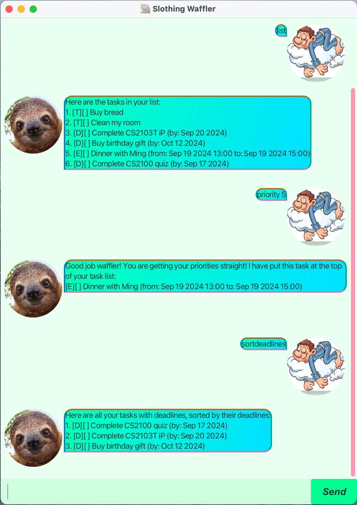

# Slothing Waffler User Guide


Slothing Waffler is a convenient task management companion to beat procrastination alongside you!

## Features
### Add Todos: `todo`
Add a task with no deadline or timeline to your task list.

Format: `todo <description>`
- Example: `todo buy bread`
    - Expected outcome:
      ```
      Keep it up! I've added this new task:
        [T][ ] buy bread
      You now have 1 task(s) to do.
      ```
### Add Deadlines: `deadline`
Add a task with a specific deadline to your task list.

Format: `deadline <description> /by <deadline>`
- Example: `deadline complete assignment 4 /by 2024-08-25`
    - Expected outcome:
      ```
      Keep it up! I've added this new task:
        [D][ ] complete assignment 4 (by: Aug 25 2024)
      You now have 2 task(s) to do.
      ```
### Add Events: `event`
Add a task/event with a specific timeline to your task list.

Format: `event <description> /from <start_date_time> /to <end_date_time>`
- Example: `event dinner with Jonathan /from 2024-10-20 16:00 /to 2024-10-20 18:00`
    - Expected outcome:
      ```
      Keep it up! I've added this new task:
      [E][ ] dinner with Jonathan (from: Oct 20 2024 16:00 to: Oct 20 2024 18:00)
      You now have 3 task(s) to do.
      ```
### List tasks: `list`
Display a list of all tasks in your task list.

Format: `list`
- Example: `list`
    - Expected outcome:
      ```
      Here are the tasks in your list:
      1.[T][ ] buy bread
      2.[D][ ] complete assignment 4 (by: Aug 25 2024)
      3.[E][ ] dinner with Jonathan (from: Oct 20 2024 16:00 to: Oct 20 2024 18:00)
      ```
### Mark tasks: `mark`
Mark a particular task as done.

Format: `mark <task_number>`
- Example: `mark 1`
    - Expected outcome:
      ```
      Great job! I've marked this task as done:
        [T][X] buy bread
      ```
### Find tasks: `find`
Find tasks containing a specific keyword

Format: `find <keyword>`
- Example: `find dinner`
    - Expected outcome:
      ```
      Here are the matching tasks in your list:
      1.[T][ ] dinner with Jonathan (from: Oct 20 2024 16:00 to: Oct 20 2024 18:00)
      ```
### Delete tasks: `delete`
Delete a specific task from your task list

Format: `delete <task_number>`
- Example: `delete 1`
    - Expected outcome:
      ```
      Just clearing up I see. I've removed this task:
      [T][X] buy bread
      You now have 2 task(s) to do.
      ```
### Prioritise tasks: `priority`
Pushes a particular task to the top of your task list.

Format: `priority <task_number>`
- Example: `priority 2`
    - Expected outcome:
      ```
      Good job waffler! You are keeping your priorities straight! 
      I have put this task at the top of your task list:
      [E][ ] dinner with Jonathan (from: Oct 20 2024 16:00 to: Oct 20 2024 18:00)
      ```
### Sort tasks by deadline: `sortdeadlines`
Provide a concise list of tasks with deadlines sorted in chronological order.

Format: `sortdeadlines`
- Example: `sortdeadlines`
    - Expected outcome:
      ```
      Here are all your tasks with deadlines, sorted by their deadlines:
      1. [D][ ] complete assignment 4 (by: Aug 25 2024)
      ```
### Exit the program: `bye`
Close the chatbot. The application will exit automatically.

Format: `bye`
- Example: `bye`
    - Expected outcome:
      ```
      See you next time! Remember to get a waffle!
      ```